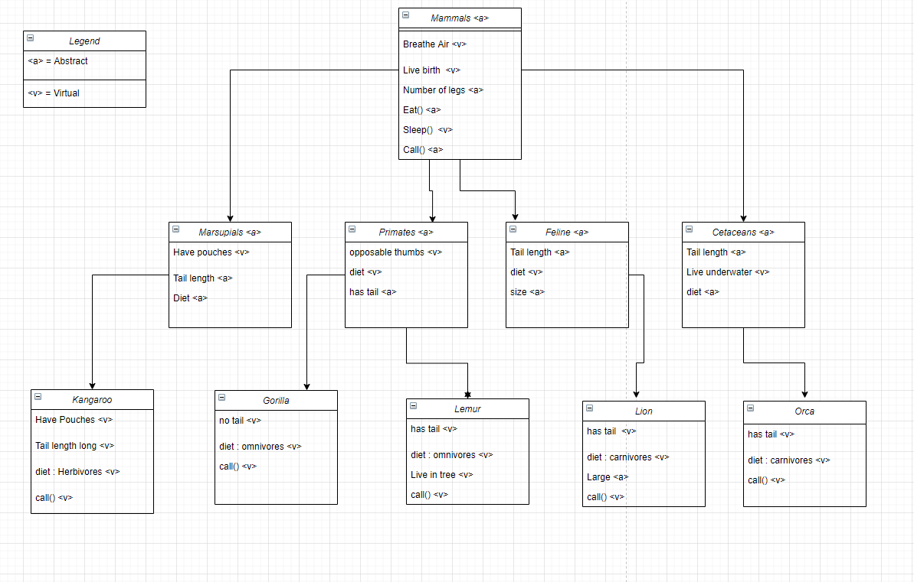

# Zoo

## Zoo Introduction

This zoo app only serves the purpose of teaching me how to use the virtual and abstract properties, as well as interfaces.

## Structure

## OOP Principles
- Abstract: Essentially requiring the idea of something, meant to be a parent class, or a property/method overridden later.
	- All parent classes are abstract in this app (they don't have to be')
	- The Mammals god class has a int variable for legs that is abstract, because all my bottom level classes have anywhere between 0-4 legs.
- Virtual: Setting a default for a property or method, does not have to be written over later.
	- The eat method in the Mammals god class has one write method, which is added to by each lowest tier class.
	- The Primates class sets the diet property to omnivore, since all primates, while largely herbivores, do eat bugs, and grubs.
- Interface: Feels like a tack on parent class? Not real clear on the uses for this.
	- The interfaces I implement, are IEat and IMature, they track if any given critter is hungry, and has an eat function to fix that. IMature keeps track of age, and what stage of life the animal is in.
